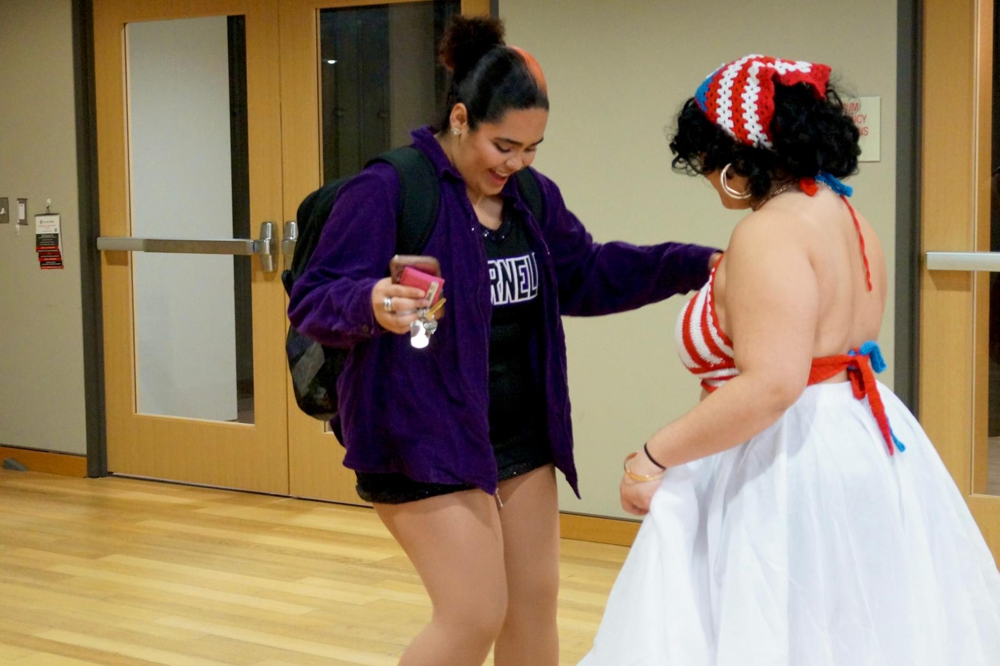
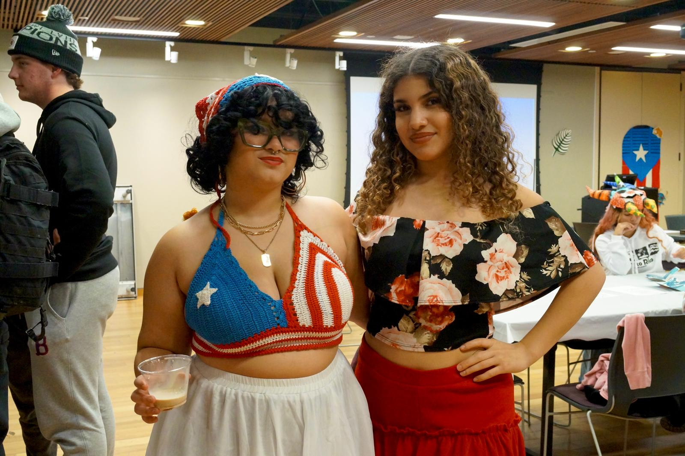
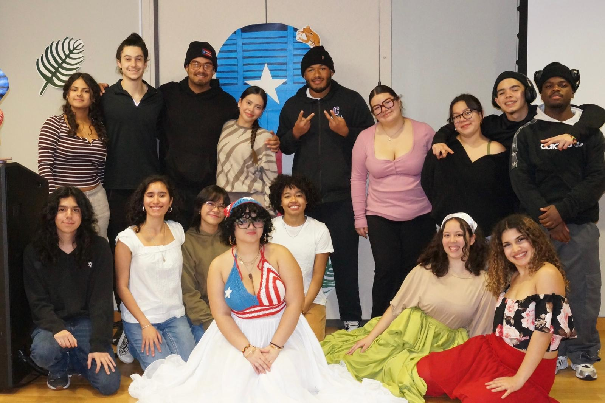

Last block, Gente and Posse Puerto Rico hosted their first ever Dia De La Puertorriqueñidad on the Hilltop! In celebrating Puerto Rico week, Gente put together a variety of activities in Hall Perrine—helping bring Puerto Rican Traditions to campus.

When students walked in, they were first greeted by a variety of songs from Hispanic artists such as Preciosa by Marc Antony to Pa que se lo gozen by Tego Calderon. As music plays in the background, students serve themselves with different Puerto Rican dishes like empanadillas and el coquito. On the side, there were coloring stations set up and dominoes to play. Claudia Collazo ‘27 highlights, “Something that I was genuinely excited about [was] having people play dominoes! It’s such a Caribbean thing to play, especially in Puerto Rico, like at parties.” Soon after, Collazo gave a presentation on the importance of Dia De La Puertorriqueñidad. As Collazo conveyed, Dia De La Puertorriqueñidad is a week in Puerto Rico where schools highlight the cultures, traditions and the ancestral roots of Puerto Ricans. Hosting it on the second day, when Chritistopher Columbus arrived to Puerto Rico, Dia De La Puertorriqueñidad is meant to reclaim and celebrate Puerto Rican cultures. Furthermore, Collazo explained the different cultural symbols in the room, from Puerto Rico’s flag to its national flower, Flor de
Maga.

At the end, Victoria Gonzalez ‘29 invited participants onto the “dance floor,” and taught them how to dance Salsa!

When asked about the significance of this event, Sara Rodriguez ‘29 highlights, “This event is important because we are sharing our culture, and informing more people about it!” And for many international students from Puerto Rico, this event was home. “I get to bring home into our campus’ life.” Isabella Rivera ‘27 chuckled, “We have a huge community of Puerto Ricans so it’s like a little bit of home.” The event wrapped up with Gonzalez personally performing Salsa while laughter erupted as participants played their last games of dominoes. Not only had Gente and Posse Puerto Rico provided many students the opportunity to experience Dia De La Puertorriquenidad, they also brought in aspects of “home” for many Puerto Rican students on our campus. When cultural diversity is needed more than ever on campus, these kinds of events have been rather potent in highlighting that diversity in our community.

